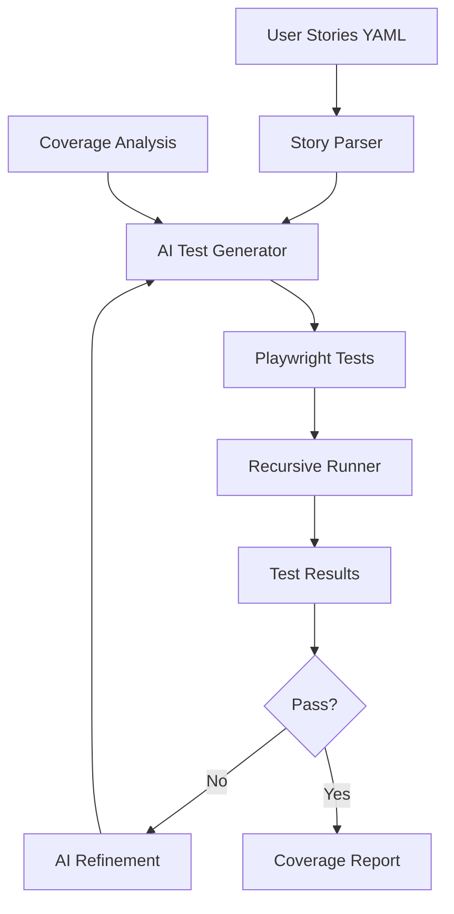

# AI-Powered Testing Guide

## Overview

This document describes the AI-powered testing system that automatically generates, executes, and maintains Playwright E2E tests based on user stories and coverage gaps.

## Architecture



## Components

### 1. User Stories (`USER_STORIES.yml`)

Machine-readable catalog of application functionality:

```yaml
stories:
  - id: project-create
    role: developer
    action: create a new project
    goal: start using Claude Code UI
    criteria:
      - Can enter project name
      - Can select project directory
      - Project appears in sidebar
    priority: critical
    tags: [project-management, onboarding]
```

### 2. Test Environment

Isolated test mode that:
- Uses temporary directories
- Provides deterministic Claude CLI responses
- Seeds predictable test data
- Prevents interference between tests

### 3. AI Test Generator

Converts user stories into executable Playwright tests:

```typescript
// Generated test example
test('developer can create a new project', async ({ page }) => {
  await page.goto('/');
  await page.getByTestId('create-project-button').click();
  await page.getByTestId('project-name-input').fill('Test Project');
  await page.getByTestId('project-path-input').fill('/tmp/test-project');
  await page.getByTestId('create-project-submit').click();
  
  await expect(page.getByTestId('project-Test Project')).toBeVisible();
});
```

### 4. Recursive Test Runner

Orchestrates the entire testing pipeline:
- Analyzes coverage gaps
- Generates missing tests
- Executes tests with retry logic
- Refines failed tests automatically

## Usage

### Running AI Tests

```bash
# Full AI testing pipeline
pnpm test:ai

# Generate missing tests only
pnpm test:ai:generate

# Watch mode for continuous testing
pnpm test:ai:watch
```

### Manual Test Generation

```bash
# Generate tests for specific stories
pnpm test:e2e:browser -- --generateMissing --storyIds=project-create,session-chat

# Generate tests by priority
pnpm test:e2e:browser -- --generateMissing --storyPriority=critical,high

# Generate tests for specific tags
pnpm test:e2e:browser -- --generateMissing --storyTags=chat,git
```

### Environment Variables

```bash
# Required for AI generation
export OPENAI_API_KEY=your-api-key

# Enable test mode
export TEST_MODE=true

# Set test concurrency
export TEST_CONCURRENCY=3

# Enable verbose logging
export DEBUG=ai-test:*
```

## Test Categories

### 1. Critical Path Tests

Essential user journeys that must always work:
- Project creation and selection
- Basic chat functionality
- File viewing and editing
- Git operations

### 2. Feature Tests

Specific feature validation:
- Tool permissions
- Dark mode toggle
- Mobile responsiveness
- Session management

### 3. Edge Case Tests

Uncommon scenarios and error handling:
- Network failures
- Large file handling
- Concurrent operations
- Permission errors

## Best Practices

### 1. Writing User Stories

Keep stories:
- **Specific**: Clear actions and expected outcomes
- **Atomic**: One feature per story
- **Testable**: Concrete acceptance criteria
- **Tagged**: Proper categorization for filtering

### 2. Test Organization

```
apps/frontend/src/__tests__/
├── generated/          # AI-generated tests
│   ├── critical/      # Critical path tests
│   ├── features/      # Feature tests
│   └── edge-cases/    # Edge case tests
├── fixtures/          # Test data and utilities
└── manual/           # Manually written tests
```

### 3. Maintenance

- Review generated tests regularly
- Update user stories as features evolve
- Monitor test flakiness
- Refine AI prompts based on results

## Debugging

### Common Issues

1. **Test Generation Fails**
   ```bash
   # Check OpenAI API key
   echo $OPENAI_API_KEY
   
   # Validate user stories
   pnpm test:validate-stories
   ```

2. **Tests Fail in CI**
   ```bash
   # Run with headed browser locally
   pnpm test:e2e:browser -- --headed
   
   # Enable debug mode
   DEBUG=pw:api pnpm test:e2e:browser
   ```

3. **Coverage Gaps**
   ```bash
   # Generate coverage report
   pnpm test:coverage
   
   # View detailed coverage
   open coverage/index.html
   ```

### Logs and Reports

Test results are saved to:
- `test-results/` - Playwright reports
- `coverage/` - Coverage data
- `_errors/` - Brain monitor error logs
- `.claude/test-history/` - Historical test data

## Advanced Configuration

### Custom Test Generation

Create custom generation strategies:

```typescript
// tooling/testing/src/ai-generation/strategies/custom.ts
export class CustomStrategy implements GenerationStrategy {
  async generateTest(story: UserStory): Promise<string> {
    // Custom generation logic
  }
}
```

### Test Refinement Rules

Configure how tests are refined on failure:

```yaml
# .claude/test-refinement.yml
rules:
  - pattern: "timeout waiting for selector"
    action: increase-timeout
    params:
      multiplier: 2
      
  - pattern: "element not visible"
    action: add-wait-for-visible
    
  - pattern: "network error"
    action: add-retry-logic
```

## Integration with CI/CD

### GitHub Actions Example

```yaml
name: AI Tests
on: [push, pull_request]

jobs:
  test:
    runs-on: ubuntu-latest
    steps:
      - uses: actions/checkout@v4
      - uses: pnpm/action-setup@v2
      - uses: actions/setup-node@v4
      
      - name: Install dependencies
        run: pnpm install
        
      - name: Run AI tests
        env:
          OPENAI_API_KEY: ${{ secrets.OPENAI_API_KEY }}
          TEST_MODE: true
        run: pnpm test:ai
        
      - name: Upload test results
        if: always()
        uses: actions/upload-artifact@v4
        with:
          name: test-results
          path: |
            test-results/
            coverage/
```

## Future Enhancements

### Planned Features

1. **Visual Regression Testing**
   - Screenshot comparison
   - AI-powered visual validation
   
2. **Performance Testing**
   - Load time analysis
   - Memory leak detection
   
3. **Accessibility Testing**
   - WCAG compliance checks
   - Screen reader validation

4. **Multi-browser Testing**
   - Cross-browser compatibility
   - Mobile device testing

### Research Areas

- Self-healing tests that adapt to UI changes
- Predictive test generation based on code changes
- Natural language test specifications
- AI-powered test prioritization

## Contributing

To contribute to the AI testing system:

1. Add new user stories to `USER_STORIES.yml`
2. Implement custom generation strategies
3. Improve test stability and performance
4. Document patterns and best practices

See [CONTRIBUTING.md](../../CONTRIBUTING.md) for general guidelines.