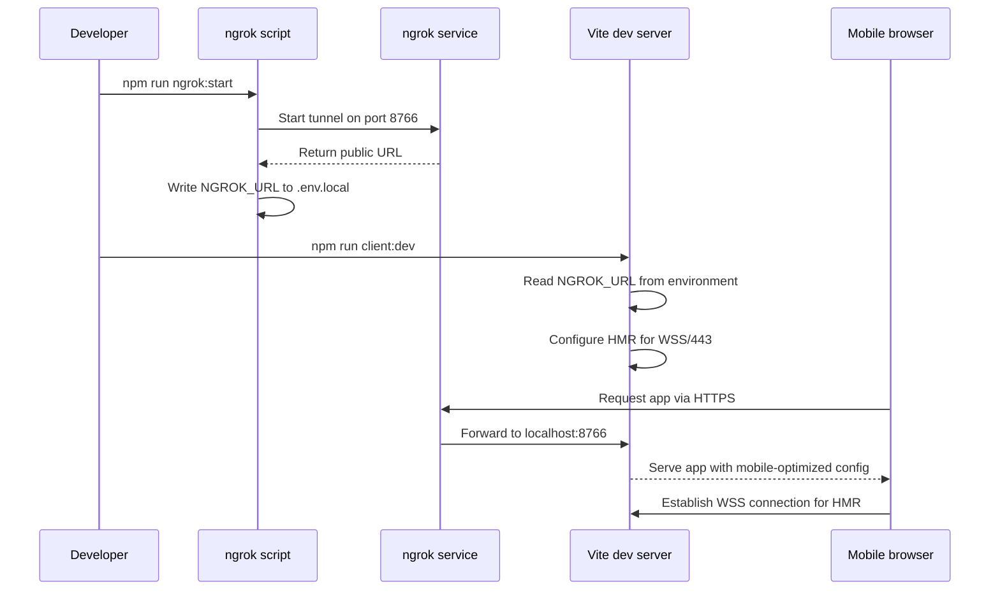

# Mobile Development Guide

This guide covers everything you need to know about developing and testing the Claude Code UI on mobile devices using ngrok.

## Quick Start

The easiest way to test on mobile devices is using our enhanced ngrok workflow:

```bash
# Option 1: Start ngrok and frontend separately
npm run ngrok:start    # Start ngrok tunnel and set NGROK_URL
npm run client:dev     # Start Vite with ngrok configuration

# Option 2: Start everything together
npm run ngrok:dev      # Start backend + ngrok + frontend all at once
```

## Table of Contents

- [Quick Start](#quick-start)
- [Setup and Configuration](#setup-and-configuration)
- [How It Works](#how-it-works)
- [Mobile Debugging](#mobile-debugging)
- [Troubleshooting](#troubleshooting)
- [Common Issues](#common-issues)
- [Best Practices](#best-practices)
- [Advanced Configuration](#advanced-configuration)

## Setup and Configuration

### Prerequisites

1. **ngrok installed**: Install from [ngrok.com](https://ngrok.com)
2. **ngrok authenticated**: Run `ngrok authtoken YOUR_TOKEN`
3. **Mobile device**: Connected to the internet (any network)

### Environment Variables

The system uses the `NGROK_URL` environment variable to configure mobile-optimized settings:

```bash
# Automatically set by npm run ngrok:start
NGROK_URL=https://your-subdomain.ngrok.io
```

When `NGROK_URL` is set, Vite automatically configures:
- **Protocol**: WSS (secure WebSocket) instead of WS
- **Port**: 443 instead of 8766
- **Host**: ngrok hostname instead of localhost
- **CORS**: Enabled for cross-origin mobile access

## How It Works

### Architecture Overview



### HMR (Hot Module Replacement) Configuration

The system automatically detects ngrok usage and configures HMR appropriately:

**Local Development** (no ngrok):
```javascript
hmr: {
  port: 8766,
  host: 'localhost',
  protocol: 'ws'
}
```

**Mobile Development** (with ngrok):
```javascript
hmr: {
  clientPort: 443,
  host: 'your-subdomain.ngrok.io',
  protocol: 'wss'  // Secure WebSocket
}
```

## Mobile Debugging

### Built-in Debug Features

The app includes comprehensive mobile debugging capabilities:

#### Automatic Debug Mode
Debug mode is automatically enabled when:
- Mobile user agent is detected, OR
- URL contains `?debug=true`, OR
- `localStorage.mobile-debug` is set to `'true'`

#### Debug Information Logged
- User agent string
- Viewport dimensions and device pixel ratio
- Feature availability (localStorage, WebSocket, Service Worker, touch support)
- Platform detection (iOS, Android, mobile)
- Global error events and unhandled promise rejections

#### Enable Debug Mode
```javascript
// Via URL parameter
https://your-subdomain.ngrok.io/?debug=true

// Via localStorage (persists across sessions)
localStorage.setItem('mobile-debug', 'true');
```

### Browser Developer Tools on Mobile

#### iOS Safari
1. Enable **Develop** menu on Mac: Safari → Preferences → Advanced → Show Develop menu
2. Connect iPhone via USB
3. Safari → Develop → [Your iPhone] → [Your Website]

#### Android Chrome
1. Enable **Developer Options** on Android
2. Enable **USB Debugging**
3. Connect via USB
4. Chrome → More tools → Remote devices → Inspect

### Mobile-Specific Error Handling

Enhanced error boundaries provide detailed mobile debugging information:

```javascript
// Automatic error reporting includes:
{
  message: "Error message",
  stack: "Stack trace",
  userAgent: "Mobile browser info",
  viewport: { width: 390, height: 844 },
  features: { webSocket: true, localStorage: true },
  platform: { isMobile: true, isIOS: true }
}
```

## Troubleshooting

### White Screen Issues

**Symptom**: App loads on desktop but shows white screen on mobile

**Common Causes**:
1. **HMR Connection Failure**: WebSocket can't connect
2. **Mixed Content Errors**: HTTP requests from HTTPS page (via ngrok)
3. **JavaScript Errors**: Modern JS features not supported
4. **Viewport Issues**: CSS rendering problems
5. **CORS Problems**: Cross-origin request blocked

**Solutions**:
1. Check if `NGROK_URL` is set: `echo $NGROK_URL`
2. Verify ngrok tunnel: Visit `http://localhost:4040` for ngrok dashboard
3. Enable debug mode: Add `?debug=true` to URL
4. Check browser console for specific errors

### WebSocket Connection Problems

**Symptom**: "WebSocket connection failed" in console

**Solutions**:
```bash
# 1. Restart ngrok to get fresh URL
npm run ngrok:start

# 2. Clear .env.local and restart
rm .env.local
npm run ngrok:start

# 3. Check ngrok is running
curl http://localhost:4040/api/tunnels
```

### HMR Not Working

**Symptom**: Changes don't update automatically on mobile

**Debug Steps**:
1. Check WebSocket connection in browser dev tools
2. Verify `NGROK_URL` in console output
3. Test WebSocket manually:
   ```javascript
   new WebSocket('wss://your-subdomain.ngrok.io:443')
   ```

### Performance Issues

**Symptom**: App is slow or unresponsive on mobile

**Solutions**:
1. Disable polling if unnecessary:
   ```javascript
   // In vite.config.js
   watch: {
     usePolling: false  // Change from true
   }
   ```
2. Reduce bundle size for mobile
3. Enable compression in production

## Common Issues

### Issue: "ngrok not found"
```bash
Error: ngrok: command not found
```
**Solution**: Install ngrok from [ngrok.com](https://ngrok.com) and ensure it's in your PATH.

### Issue: "Account limit exceeded"
```bash
Error: Your account is limited to 1 tunnel
```
**Solution**: 
- Kill existing ngrok processes: `pkill -f ngrok`
- Or upgrade to ngrok paid plan

### Issue: "Tunnel not found"
```bash
Error: Failed to get ngrok URL after 10 attempts
```
**Solution**:
1. Check ngrok dashboard: `http://localhost:4040`
2. Restart ngrok: `npm run ngrok:start`
3. Check firewall/network restrictions

### Issue: "Mixed content error" / "426 Upgrade Required"
```bash
GET http://localhost:8766/session/xxx 426 (Upgrade Required)
Mixed Content: The page was loaded over HTTPS, but requested an insecure resource
```
**Solution**: This happens when accessing via ngrok HTTPS but making HTTP requests:
1. The app automatically detects ngrok and uses HTTPS URLs
2. Check browser console for mixed content warnings
3. Verify no hardcoded `http://localhost` URLs in code
4. Use relative URLs (`/api/...`) instead of absolute URLs

### Issue: "CORS error on mobile"
```bash
Access to fetch at 'https://...' from origin 'https://...' has been blocked by CORS policy
```
**Solution**: CORS is enabled automatically with ngrok. Check:
1. Backend is running: `npm run backend:dev`
2. API proxy configuration in `vite.config.js`

### Issue: "Mixed content error"
```bash
Mixed Content: The page was loaded over HTTPS, but requested an insecure resource
```
**Solution**: Ensure all API calls use HTTPS when accessed via ngrok.

## Mobile Component Implementation

### BacklogBoard Mobile Implementation

The BacklogBoard component demonstrates the **Platform Pathways Pattern Level 3** - a comprehensive approach to mobile-first development that provides optimal experiences for each platform.

#### Architecture Overview

```
BacklogBoard.jsx (Entry Point)
├── Platform Detection (useIsMobile hook)
├── BacklogBoard.web.jsx (Desktop Implementation)
└── BacklogBoard.mobile.jsx (Mobile Implementation)
    ├── Shared Logic: BacklogBoard.logic.js
    ├── Mobile Styles: BacklogBoard.mobile.styles.js
    └── TaskCard Components
        ├── TaskCard.jsx (Entry Point)
        ├── TaskCard.web.jsx (Desktop)
        ├── TaskCard.mobile.jsx (Mobile)
        └── TaskCard.logic.js (Shared Logic)
```

#### Key Mobile Features

**Mobile-Optimized UI:**
- **Simplified Header**: Hamburger menu + project title + floating action button
- **Collapsible Metrics Panel**: Save vertical space with expandable metrics
- **Bottom Sheet Modals**: Native-feeling filters and task movement interfaces
- **Touch-Friendly Task Cards**: Minimum 44px touch targets, larger padding
- **Tap-to-Move**: Alternative to drag-and-drop for task status changes

**Responsive Interactions:**
- **Touch Feedback**: Visual feedback on tap/press actions
- **Safe Area Support**: iOS safe area insets for modern devices
- **Gesture-Friendly**: Long-press context menus, swipe interactions
- **Accessibility**: Proper ARIA labels and semantic markup

#### File Structure

```bash
src/features/backlog/
├── BacklogBoard.jsx                    # Platform detection entry point
├── BacklogBoard.web.jsx               # Desktop-specific implementation
├── BacklogBoard.mobile.jsx            # Mobile-specific implementation  
├── BacklogBoard.mobile.styles.js      # Mobile-only styled components
├── BacklogBoard.logic.js              # Shared business logic
├── BacklogBoard.mobile.stories.jsx    # Mobile Storybook stories
└── components/TaskCard/
    ├── TaskCard.jsx                   # Platform detection entry point
    ├── TaskCard.web.jsx              # Desktop task card with drag-and-drop
    ├── TaskCard.mobile.jsx           # Mobile task card with tap interactions
    └── TaskCard.logic.js             # Shared task formatting logic
```

#### Usage Example

```javascript
// The component automatically adapts to platform
import BacklogBoard from './features/backlog/BacklogBoard';

function App() {
  return (
    <BacklogBoard 
      selectedProject={project}
      selectedSession={session}
    />
  );
}

// On mobile: renders BacklogBoard.mobile.jsx
// On desktop: renders BacklogBoard.web.jsx
```

#### Mobile Testing with Storybook

Access mobile-specific stories:
```bash
# Start Storybook
npm run storybook

# Navigate to: Features/Mobile/BacklogBoard
# Viewport is automatically set to iPhone 12 dimensions
```

Available mobile stories:
- **Default**: Populated backlog with sample tasks
- **Empty**: Empty state testing
- **Loading**: Loading state testing
- **Error**: Error state handling
- **Many Tasks**: Performance testing with 20+ tasks
- **Interactive**: Full interaction testing

#### Implementation Benefits

**Shared Business Logic:**
- Single source of truth for task management
- Consistent behavior across platforms
- Easier testing and maintenance

**Platform-Specific UX:**
- Web: Full-featured kanban with drag-and-drop
- Mobile: Touch-optimized with bottom sheets and tap interactions

**Performance Optimized:**
- Code splitting: Mobile code not loaded on desktop
- Lazy loading: Platform-specific components loaded on demand
- Reduced bundle size: Each platform loads only what it needs

#### Mobile-Specific Considerations

**Touch Interactions:**
```javascript
// Mobile TaskCard with tap-to-move
<TaskCard
  task={task}
  onEdit={() => openEditModal(task)}
  onMove={() => openMoveBottomSheet(task)}  // Mobile-specific
  isMobile={true}
/>
```

**Bottom Sheet Implementation:**
```javascript
// Mobile-friendly modals
<BottomSheet isOpen={isMoveBottomSheetOpen}>
  <BottomSheetHandle />
  <BottomSheetTitle>Move Task</BottomSheetTitle>
  {/* Status selection options */}
</BottomSheet>
```

**Safe Area Support:**
```css
/* Mobile styles with iOS safe area */
padding-top: env(safe-area-inset-top);
padding-bottom: calc(1rem + env(safe-area-inset-bottom));
```

#### When to Use Platform Pathways Pattern

**Level 3 (Full Separation) - Use when:**
- Significantly different UI layouts are needed
- Platform-specific interactions are required (drag-and-drop vs touch)
- Complex state management benefits from separation
- Performance optimization is critical

**Alternative Patterns:**
- **Level 1 (CSS-only)**: Simple responsive differences
- **Level 2 (Conditional Rendering)**: Minor layout adjustments

## Best Practices

### Development Workflow

1. **Start with desktop**: Develop features on desktop first
2. **Test early**: Check mobile regularly during development
3. **Use real devices**: Simulators can't catch all issues
4. **Test multiple browsers**: Safari, Chrome, Firefox mobile
5. **Check different screen sizes**: Phone, tablet, landscape/portrait

### Performance Optimization

1. **Lazy load components**: Use React.lazy() for large components
2. **Optimize images**: Use appropriate formats and sizes for mobile
3. **Minimize JavaScript**: Tree-shake unused code
4. **Use CDN**: For static assets in production

### Debugging Tips

1. **Keep console open**: Monitor for errors continuously
2. **Use debug mode**: Enable detailed logging with `?debug=true`
3. **Test offline**: Check PWA functionality
4. **Validate HTML**: Ensure semantic markup for accessibility

### Security Considerations

1. **ngrok tunnels are public**: Anyone with the URL can access your app
2. **Don't commit .env.local**: Contains ngrok URLs
3. **Use HTTPS only**: ngrok provides SSL certificates
4. **Rotate URLs**: Restart ngrok periodically for fresh URLs

## Advanced Configuration

### Custom ngrok Configuration

Create `ngrok.yml` for advanced settings:
```yaml
version: "2"
tunnels:
  claude-ui:
    addr: 8766
    proto: http
    subdomain: my-custom-subdomain
    region: us
    inspect: true
```

Use with: `ngrok start claude-ui`

### Custom Vite HMR Configuration

Override HMR settings in `vite.config.js`:
```javascript
export default defineConfig({
  server: {
    hmr: {
      // Force specific settings
      clientPort: 443,
      protocol: 'wss',
      host: 'my-custom-domain.ngrok.io'
    }
  }
});
```

### Environment-Specific Configuration

Create environment-specific scripts:
```json
{
  "scripts": {
    "dev:mobile": "NODE_ENV=mobile npm run ngrok:dev",
    "dev:tablet": "NODE_ENV=tablet npm run ngrok:dev"
  }
}
```

### Automated Testing on Mobile

Use Playwright for automated mobile testing:
```javascript
// playwright.config.js
module.exports = {
  projects: [
    {
      name: 'Mobile Safari',
      use: { ...devices['iPhone 12'] }
    },
    {
      name: 'Mobile Chrome',
      use: { ...devices['Pixel 5'] }
    }
  ]
};
```

## Scripts Reference

| Script | Description |
|--------|-------------|
| `npm run ngrok` | Start ngrok tunnel only |
| `npm run ngrok:start` | Start ngrok and set NGROK_URL |
| `npm run dev:ngrok` | Start ngrok then frontend |
| `npm run ngrok:dev` | Start backend + ngrok + frontend |
| `npm run client:dev` | Start Vite dev server |
| `npm run backend:dev` | Start backend API server |

## Environment Variables Reference

| Variable | Description | Set By |
|----------|-------------|---------|
| `NGROK_URL` | Public ngrok tunnel URL | ngrok script |
| `VITE_PORT` | Frontend dev server port | User |
| `VITE_API_PORT` | Backend API server port | User |

## Files Modified for Mobile Support

- `scripts/start-ngrok.js` - Enhanced to set NGROK_URL
- `vite.config.js` - Mobile-optimized HMR configuration
- `src/app/main.jsx` - Mobile debugging utilities
- `src/utils/url.js` - **NEW**: Dynamic URL utilities for ngrok detection
- `src/features/preview/` - Fixed hardcoded localhost URLs
- `index.html` - Mobile-friendly viewport settings
- `package.json` - New mobile development scripts
- `.env.example` - NGROK_URL documentation

## Need Help?

If you encounter issues not covered in this guide:

1. Check the [ngrok documentation](https://ngrok.com/docs)
2. Review Vite's [mobile development guide](https://vitejs.dev/guide/build.html#browser-compatibility)
3. Enable debug mode and share console output
4. Test with a minimal reproduction case

Happy mobile developing! 📱✨